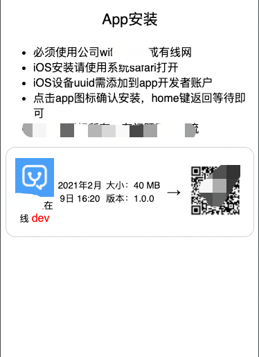
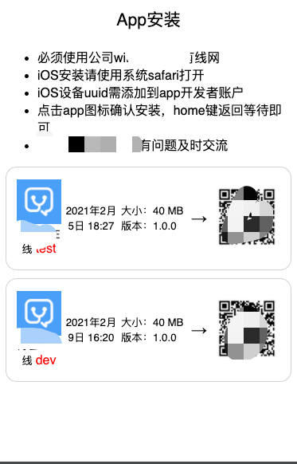
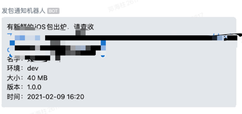

## 说明

- 搭建内网ipa plist访问地址
- 支持推送到企业微信
- 自动解析ipa包，并还原ios icon
- 支持单个包访问或者列表访问
- 支持二维码扫描访问
## 要求
- 部署需要https域名
- 需要python3环境

## 使用到的技术
- 私有协议 `itms-services://?action=download-manifest&url=https://domain/path`
- ios 图标还原编码
- 二维码生成
- python django框架
- 微信markdown通知

## 功能截屏




默认通知样式




## 运行

1、使用开发模式调试
```shell
PYTHONUNBUFFERED=1;DJANGO_SETTINGS_MODULE=appDownloads.settings;python3 manage.py runserver 0.0.0.0:8000
```


2、使用其他模式，可以搜索 `django部署`

```shell
python3 manage.py runserver 0.0.0.0:8000
```

## 依赖

为了不污染其他python可以使用virtualenv模式创建，例如我的依赖构建过程
``` 
pip install virtualenv
virtualenv django --python=python3.9
pip3 install -r requirements.txt

```


如果删除db的话，需要重新构建db
```
 python3 manage.py makemigrations appDownloads 
 python3 manage.py migrate

```

## 部署


因为iOS发布开发包的话需要使用https，例如我们项目使用 https://x.xx.com/

解析是
```
~/Downloads » nslookup x.xx.com                                                                                              denghaizhu@denghaizhudeMacBook-Pro
Server:		114.114.114.114
Address:	114.114.114.114#53

Non-authoritative answer:
Name:	x.xx.com
Address: 192.168.10.244
```
这个域名让运维同学解析到内网ip，之所以使用内网的话
- 内部上传ipa文件快
- 内部访问下载快
- 管理方便
- 如果修改自己的域名，请修改 settings.py `IOS_PLIST_DOMAIN`


## 使用

在jenkins或者自己打完包后，自己上传ipa，本程序自己解析ipa包信息生成下载地址

参数说明

|参数|说明|
|--|--|
|file|ipa文件地址|
|key|企业微信机器人的key|
|env|环境，例如test|
|identifier|app唯一标识符|

机器人的`KEY`一定要换成自己的

`url`为: `/upload/{env}`
`method`: `POST`

例如

```shell
curl -X POST 'https://youdomain./upload/test'  --form 'key="8a2c4882-0121-4d2a-a80e-358e9d3f8ec0"' --form file=@"/Users/denghaizhu/Downloads/apk/20210203_1044_ios.ipa" '
```

上传后访问本ipa网站地址： `/app/{identifier}`

所有环境和app地址：`/`
 